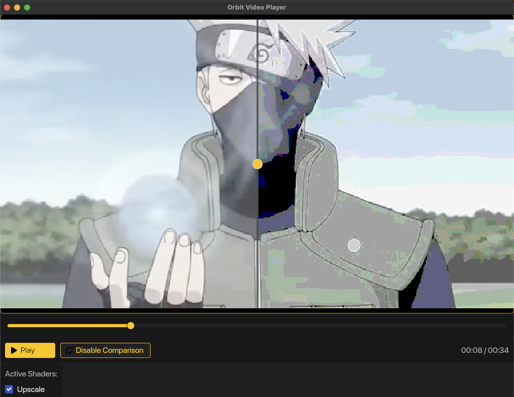

# Orbit Video Player

A fun video player project with real-time shader effects processing built with Rust, iced, and WGPU.

## Overview

Orbit Video Player is a hobby project that allows you to apply and stack custom WGSL shader effects to videos in real-time. The application processes effects in a linear pipeline, where each shader takes the output of the previous shader (or the original video) as its input. This personal learning project explores graphics programming without requiring external libraries or complex setup.

**Key Features:**

- Real-time shader application to video playback
- Linear shader stacking with customizable ordering
- Side-by-side comparison between original and processed video
- Native performance using WGPU for GPU acceleration
- Clean, responsive UI built with iced
- FFmpeg integration for video processing

## Preview



_The Orbit Video Player interface showing a video with applied shaders and the comparison view._

## Installation

```bash
# Clone the repository
git clone https://github.com/vrrashkov/orbit-video-player.git
cd orbit-video-player

# run
cargo run
```

## Usage

### Loading a Video

Currently, the video must be loaded through the code. A file browser for video selection is planned for future releases.

#### Editing Shader Parameters

- Each shader exposes its unique parameters in the properties panel
- Changes to parameters are applied in real-time

### Comparison View

Toggle the comparison view by clicking the "Comparison" button. This feature displays:

- Original video on the left
- Fully processed video (with all shaders applied) on the right
- A draggable divider to adjust the comparison ratio

### Controls

Standard video controls are available at the bottom of the interface:

- Play/Pause button
- Seek: Click on the progress bar
- Apply Shader: Enable the shader you want to apply
- Comparison: Compare shader with original video

## Architecture

Orbit Video Player follows a modular architecture that separates concerns and enables extensibility:

## Built-in Shaders

Orbit Video Player currently includes two essential built-in shaders:

| Shader     | Description                                        | Parameters           |
| ---------- | -------------------------------------------------- | -------------------- |
| Upscale    | Improves resolution of lower quality videos        | Scale Factor, Method |
| YUV to RGB | Converts YUV color space to RGB for proper display | None                 |

## Creating Custom Shaders

To create custom shaders, check out the implementation of the Upscale shader in the source code as a reference. The shader system supports GLSL shaders.

## A Learning Project

Orbit Video Player is a personal learning project created for fun and to explore graphics programming concepts. As the developer, I'm not an experienced graphics programmer, so this project represents my journey into WGPU, shader programming, and video processing.

## Development Roadmap

### Current Limitations

- Audio is currently not supported
- Video files must be loaded through code (no file browser)
- Limited shader parameters persistence
- No project saving/loading functionality
- Only two basic built-in shaders

### Planned Improvements

#### Core Functionality

- [ ] File browser for video selection
- [ ] Audio support integration
- [ ] Keyboard shortcut system
- [ ] Performance optimizations for high-resolution videos
- [ ] Project saving/loading
- [ ] Video export with applied shaders

#### UI Improvements

- [ ] Dark/light theme toggle
- [ ] Customizable layouts
- [ ] Improved shader parameter controls
- [ ] Thumbnail previews for shader effects
- [ ] Expanded timeline controls

#### Shader System

- [ ] Additional built-in shaders (Bloom, Color Grading, etc.)
- [ ] Shader graph visualization
- [ ] Real-time shader coding interface
- [ ] Shader parameter presets
- [ ] Timeline-based shader keyframing

#### Advanced Features

- [ ] Batch processing capabilities
- [ ] Hardware acceleration optimizations
- [ ] Plugin system for extended functionality
- [ ] Multi-video compositing

## Performance Considerations

Orbit Video Player aims for real-time video processing, but performance depends on:

- Video resolution
- Shader complexity
- Number of stacked shaders
- GPU capabilities

For optimal performance:

- Start with lower resolution videos when using multiple complex shaders
- Consider reducing shader parameter values that increase computational load
- Close other GPU-intensive applications when processing high-resolution videos

## ⚠️ Resolution Compatibility Note

**Important**: Orbit Video Player currently works best with videos at 640x360 resolution. Videos with other resolutions may display incorrectly (showing only lines or graphical artifacts).

If you encounter display issues, use FFmpeg to convert your video to the supported resolution:

```bash
ffmpeg -i your_video.mp4 -vf "scale=640:360" -c:v libx264 -c:a copy compatible_video.mp4
```

For testing, you can use the sample video included in the assets/videos/ folder which is already in the compatible format.
This is a known limitation that will be addressed in future updates.
